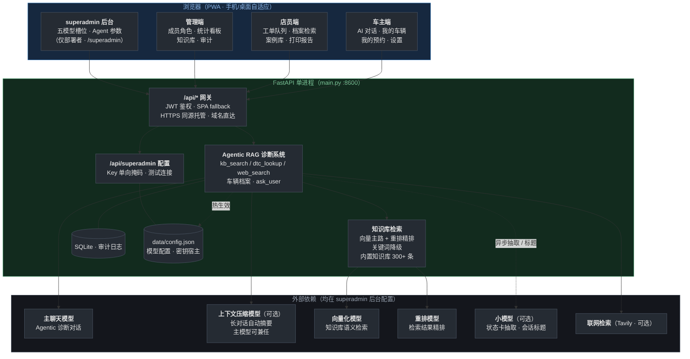

# 新能源汽车 AI 智能诊断系统 2.0

> AI-powered New Energy Vehicle Diagnostic Assistant · 车主 / 店员 / 管理员三端一体的 Agentic RAG 诊断系统 + 部署者专属 superadmin 调试后台

**简体中文** · [English](README_EN.md)

面向新能源汽车维修场景的多角色智能诊断平台：车主通过多轮对话获得结构化诊断结论并一键预约到店；店员在工单闭环中接单、回填、沉淀案例；管理员掌握成员、统计与审计；部署者另有 superadmin 调试后台，在线运维模型供应商与 Agent 运行参数。1.0（纯前端单端工具）的整体重构版本，版本间差异详见 [CHANGELOG.md](CHANGELOG.md)。

## 架构总览



整个系统按**五模型分工**运行：主聊天模型（Agentic 诊断对话）、上下文压缩模型（可选，地址与 Key 缺省自动跟随主对话配置）、向量化模型（知识库语义检索）、重排模型（对召回结果精排）、小模型（可选，诊断状态卡抽取与会话标题；缺省回退主聊天模型，云服务器部署免本地依赖）。五个槽位的地址 / 模型 / Key 均在 superadmin 后台在线配置、保存即热生效。任一环节不可用只降级不中断：压缩失败只保留最近几轮，向量化模型不可用时检索自动退化为纯关键词检索，重排服务不可用时保持原序，小模型不可用时回退主聊天模型、仍失败则跳过抽取与标题生成。各模块的详细设计与决策依据见 [技术架构设计文档](docs/技术架构设计.md)。

## 核心特性

- **Agentic 诊断对话**：DeepSeek function calling 驱动 Agent 循环（工具调用最多 6 轮、每轮最多追问 3 次，防止对话失控）；AI 的查证过程以时间线形式展示；输出结构化诊断卡（🟢🟡🔴 严重度 + 可能原因 + 检修步骤 + 待确认项）。
- **Agentic RAG 检索**：知识导入时按文档结构智能分段；检索以 bge-m3 向量为主路（实测显著优于双路融合排序），召回结果再经云端重排模型按与问题的相关性精排；向量路不可用或零召回时自动降级 jieba/BM25 关键词路，服务不中断。内置知识库 300+ 条（OBD-II 故障码表 195 条 + 电池/电机/电控知识 105 条，全部标注来源）；检索质量由红绿闸门守护——50 个典型故障问题实测 top-3 命中率 100%（门槛 80%），注入故障模式（禁用向量路 / 噪声向量 / 乱序）必须下降 ≥15% 见红，固定种子可复现，一键自检（`python -m backend.rag.eval_gate`）。
- **受控追问**：AI 信息不足时以卡片列出问题，车主点选或自由填写，「不知道 / 不清楚」兜底不卡流程；未回答的提问会随会话保存，支持离线续答。
- **上下文压缩与三层记忆**：对话超过 20 轮或超出 token 预算时，自动把早期内容压缩成摘要（压缩失败则只保留最近几轮）；记忆分三层——会话内的诊断状态卡、跨会话的车辆档案（默认车自动带入）、店员沉淀的维修案例（案例自动记录入库，纳入后续诊断的检索范围）。
- **预约闭环**：诊断卡一键预约（自动附带诊断摘要）→ 店员接单 / 改约 → 回填维修结果 → 一键沉淀案例 → HTML 打印报告（另存 PDF）；状态机强约束 + 30s 新单轮询提醒。
- **隐私边界**：诊断摘要卡始终对店员可见；**对话原文只在车主主动开启分享开关后**随工单可见（后端 403 强制，非前端隐藏）。
- **多店隔离**：业务数据全查询按 `tenant_id` 过滤（检索索引分片为商用上云前待办）。
- **统计与审计**：模型用量今日/7 天/30 天聚合、预约状态分布、案例与账号数；登录、建号、改角色、预约流转、隐私变更等全部写入审计日志，可按动作筛选。
- **移动端与 PWA**：手机自适应 + 主屏图标独立窗口运行；iOS 输入 16px 防聚焦缩放、safe-area 与动态视口适配。

## 功能演示

登录页按角色分流进入车主 / 店员 / 管理员 / 超级管理员四端首页：


车主端 Agentic 诊断对话：AI 自主调用车辆档案与知识库检索（时间线实时展示），信息不足时以卡片受控追问，最终输出结构化诊断卡（严重度 + 可能原因 + 检修步骤 + 待确认项）并支持一键预约：


管理端知识库检索测试台：命中结果标注来源（向量 / 关键词）与得分：


superadmin 调试后台（仅部署者）：在线修改模型供应商五槽位与 Agent 运行参数，保存即热生效（Key 单向掩码展示）：


## 在线体验

阿里云 ECS + Cloudflare 隧道同源直达（FastAPI :8600）：

https://nev.evoidngc.top

演示账号（初始密码 = 账号名）：user001（车主）· staff001（店员）· admin（管理员）

各端（车主 / 店员 / 管理员 / superadmin）的完整操作说明见 [操作指南](docs/操作指南.md)。

## 快速开始

环境要求：Python 3.10+（开发验证于 3.12）、Node.js 18+；推荐注册硅基流动接入免费嵌入/重排模型（见下文 config 模板），也可用本地 llama.cpp llama-server 或全部留空运行（语义检索退化为关键词检索、异步抽取回退主聊天模型）。

```bash
# 1) 后端依赖
python -m pip install -r requirements.txt

# 2) 配置：创建 data/config.json（含密钥，不进仓库；模板见下节）

# 3) 前端构建
cd frontend && npm install && npm run build && cd ..

# 4) 启动：自动建表，并创建演示账号和演示车辆
python main.py                # http://127.0.0.1:8600
python main.py --host 0.0.0.0 # 店内局域网直连

# 5) 导入内置知识库（300+ 条，按标题自动去重，可重复执行）
python -m backend.seed.load_corpus
```

开发模式：后端 `python main.py --reload`，前端 `cd frontend && npm run dev`（vite 代理 /api → 8600）。

### data/config.json 模板

```json
{
  "server": { "host": "127.0.0.1", "port": 8600 },
  "deepseek": {
    "base_url": "https://api.deepseek.com",
    "main_model": "<主对话模型名>",
    "main_key": "<你的 DeepSeek API Key>",
    "background_model": "<后台压缩模型名>",
    "background_key": "<后台摘要模型 Key，可复用 main_key>"
  },
  "tavily": { "api_key": "<你的 Tavily API Key>" },
  "local_models": {
    "embedding_url": "https://api.siliconflow.cn",
    "embedding_model": "BAAI/bge-m3",
    "embedding_key": "<你的硅基流动 API Key>",
    "rerank_url": "https://api.siliconflow.cn",
    "rerank_model": "BAAI/bge-reranker-v2-m3",
    "rerank_score_threshold": 0.0
  },
  "small_model": {
    "base_url": "",
    "model": "",
    "disable_thinking": true
  }
}
```

- 全部 API Key 只存该文件：**不进仓库、不下发前端、不写日志**；`data/` 已在 `.gitignore`。
- **推荐接入硅基流动（免费模型，检索链路 API 账单为 0）**：嵌入与重排默认指向硅基流动——`BAAI/bge-m3` 向量化（1024 维，单条 P50 约 150-190ms）与 `BAAI/bge-reranker-v2-m3` 重排（top5 块 P50 约 140ms）均在免费额度内，注册一个 Key 即可点亮语义检索 + 重排全链路；本地部署改填 llama.cpp llama-server（如 `http://127.0.0.1:11436`）亦可。
- `local_models`（可选）指向 OpenAI 兼容 HTTP 服务，留空则对应能力自动降级：`embedding_url` 为向量化服务（提供 `/v1/embeddings`），`embedding_key` 非空时请求携带 Bearer 认证（URL 不含 `/v1`，误配尾缀自动去除）；`rerank_url` 为重排服务（提供 `/v1/rerank`），对向量召回的 top_k 结果精排，`rerank_enabled` 可整体关闭、`rerank_key` 缺省复用 `embedding_key`、`rerank_score_threshold` 为重排分数阈值（0 = 纯按相关性排序；>0 时高分块插队、其余保持原序，实测当前语料分数可分性弱，默认 0）；重排服务不可达时自动保持原序，检索不中断；`subagent_url` 为本地轻量对话端点（如 llama-server :11435），仅作可选的本地部署形态。
- `small_model` 为会话标题 / 状态卡抽取的异步小模型槽位（OpenAI 兼容）：`base_url` + `model` 均留空 = 回退后台主聊天模型（自动携带 `thinking: disabled` 关闭思考，DeepSeek 实测标题 P50 约 560ms）；也可填其他 OpenAI 兼容 API（如硅基流动 `Qwen/Qwen3.5-4B` 免费，但免费档排队实测尾部可达 1 分钟，生产建议留空走主模型）。温度、Token 上限、输入截断长度均可在 superadmin 后台在线调整。
- Tavily Key 缺失或失效时 `web_search` 工具自动禁用，其余功能不受影响。
- `cors_origins` 可选，缺省白名单见 `backend/config.py`（生产域名 + 本机开发/直连端口）。同源部署（访问域名即系统）浏览器不触发 CORS，无需配置；仅前端与后端跨源调试时才需要。
- 后台压缩槽位可精简：`background_base_url` / `background_key` 省略时自动沿用主对话的地址与 Key；`background_model` 缺省 `deepseek-flash`，填与主模型同名即由主聊天模型兼任。

### 演示账号与首次部署

首次启动自动创建与「在线体验」相同的三种角色演示账号，仅为演示便利：

> ⚠️ 正式部署后请立即让各账号通过「设置 → 修改密码」更换初始密码。改密码接口强制强度校验（至少 8 位、须含字母和数字、不得包含账号名），且改密码通道不允许回退到「密码 = 账号名」的弱口令。

### superadmin 调试后台

面向公网部署的运维通道：首次启动自动创建 `superadmin` 账号（角色 `superadmin`），20 位随机字母数字密码，**每次启动后端进程都会打印到该进程的终端窗口**（启动脚本弹出的最小化 cmd 窗口点开即看）。明文仅存服务器本机 `data/config.json` 的 `superadmin` 节——与 API Key 同一密钥宿主，不进仓库、不进数据库、不出现在任何接口响应中；admin 成员管理对其不可见、不可改。登录后进入 `/superadmin` 配置页（类 AstrBot WebUI），可在线修改：

- 模型供应商：主对话 / 后台任务 / 嵌入 / 重排 / 小模型五个槽位的 API 地址、模型、Key（Key 单向掩码，留空即不修改），重排开关与分数阈值、小模型温度等参数在线可调，Tavily Key，每槽位带「测试连接」实测。
- 前端接入地址（本机浏览器）：留空 = 同源（「访问域名即进入系统」的标准形态），登录页不再提供该设置。仅当某个浏览器需要指向另一台后端（如临时调试）时才在此填写——只写当前浏览器 localStorage，不进服务器配置，带「测试连接」实测，测试成功即生效。
- Agent 运行参数：单轮最大工具调用轮数、追问上限、回复 token 上限、采样温度、工具结果截断、上下文压缩双阀门（保留轮数 / token 预算 / 最少保留轮数 / 摘要字数）、首轮强制检索（API 层 `tool_choice` 硬强制）。

除 `server`/`security` 节外全部热生效，无需重启。遗忘密码时在服务器终端运行 `python main.py --reset-superadmin` 重新生成（旧密码立即作废，明文同步写回 config.json，之后每次启动照常打印）。

### 生产重置

演示期产生的业务数据（测试账号、预约、案例等）全部存于 `data/data.db`，上生产前删库重建：

```bash
rm data/data.db                     # Windows: del data\data.db
python main.py                      # 重建数据表 + 演示账号 + 演示车辆
python -m backend.seed.load_corpus  # 重新导入内置知识库（自动去重）
```

## 部署形态

| 形态 | 做法 | 适用 |
|---|---|---|
| 单机 / 店内局域网 | `python main.py --host 0.0.0.0`，放行防火墙 TCP 8600 | 店内日常使用 |
| **云服务器 + 域名（当前采用）** | 云服务器拷贝项目目录 → `python main.py` → 域名解析指向服务器（HTTPS → 8600）；前后端同源，**访问域名即进入系统**，跨源配置一律不需要 | 公网演示 / 正式商用 |

后端是纯编排层，不承载模型算力：主对话 / 压缩 / 向量化 / 重排 / 小模型五个模型槽位全部指向 OpenAI 兼容 API（嵌入与重排均有免费模型，检索链路 API 账单为 0），算力全部在云端——后端进程内存占用不足百 MB，最低配云服务器甚至家用电脑即可承载；本地 llama.cpp llama-server 自托管只是可选形态。所有槽位地址均在 superadmin 后台在线可配，切换供应商不改代码。

## 安全设计

- **密钥**：全部后端配置管理（1.0 为前端明文 localStorage，已移除）；前端构建产物零密钥（提交前经模式扫描核验）。
- **认证**：PBKDF2-SHA256（240k 迭代）密码哈希 + JWT（7 天）；owner / staff / admin / superadmin 四角色接口级鉴权（superadmin 仅部署者，接口独立成组且对 admin 完全隔离）。
- **登录限速**：按账号失败计数，15 分钟窗口内 5 次失败即临时锁定——锁定期间不做密码校验、直接拒绝；成功登录即清零计数；锁定事件写入审计日志（`login_locked`）。单进程内存实现，商用多实例部署需换集中存储。
- **弱口令防护**：改密码强制强度校验（≥8 位、字母 + 数字、不得包含账号名）；初始密码 = 账号名仅为演示方便，改密码通道不允许把密码改回这种弱口令。
- **越权防护**：跨账号会话 / 工单按「不存在」（404）处理，不泄露存在性；车主隐私开关由后端强制。
- **审计**：登录成功 / 失败 / 锁定、建号、停用、重置密码、预约流转、隐私变更、密码修改等全部写入 `audit_logs` 表。

## 测试

```bash
python -m pytest tests/    # 103 例，全离线临时库，不触碰真实 data/
cd frontend && npm run typecheck && npm run build
```

覆盖：知识库分块与检索、上下文压缩、Agent 对话历史与工具调用记录一致性（含异常中断场景）、接口权限矩阵、预约状态流转、案例入库、成员管理、登录限速、密码强度校验、诊断状态卡抽取与会话标题生成（外部模型调用全部模拟，完全离线）。

## 目录结构

```
main.py                  启动入口（--host / --port）
backend/
  config.py              配置加载（data/config.json）
  security.py            PBKDF2 密码哈希 + JWT
  db/                    SQLAlchemy 模型 + 轻量迁移
  api/                   auth（登录限速/改密）· kb · chat（SSE 流式）· cases
                         · appointments（预约闭环）· vehicles · admin_users
                         · stats（统计+审计）· system
  rag/                   embedder / vecstore / bm25 / ingest / retrieve / eval_gate
  core/
    providers/           llm（DeepSeek 主对话 / 后台摘要）· tavily
    tools/registry.py    工具注册表
    agent/runner.py      Agent 循环 + 工具执行 + 结构化诊断输出
    agent/compressor.py  上下文压缩（长对话自动摘要）
    agent/extractor.py   本地小模型：诊断状态卡抽取 + 会话标题
  seed/                  演示账号 + 演示车辆 + 内置知识库（corpus/）
  app.py                 应用工厂（CORS + 静态托管 + SPA fallback）
frontend/                Vue 3 + TypeScript + Vite + Element Plus
tests/                   pytest 回归套件（103 例）
data/                    运行时生成：config.json / data.db / logs/（不入库）
```

## 已知限制

- 公网形态当前以「域名 + 非标端口（8600）」过渡：部署所用试用实例不满足 ICP 备案条件，备案通过后切回标准 443。
- 检索索引未按租户分片（当前所有租户共享同一份内置知识库），多租户商用前需处理。
- 登录限速为单进程内存态，多实例部署需换集中存储。
- 重排在当前语料上的增益有限（top3 已 100% 饱和、top1 +4pp），更大语料下的收益需重新评估；配置可一键关闭。
