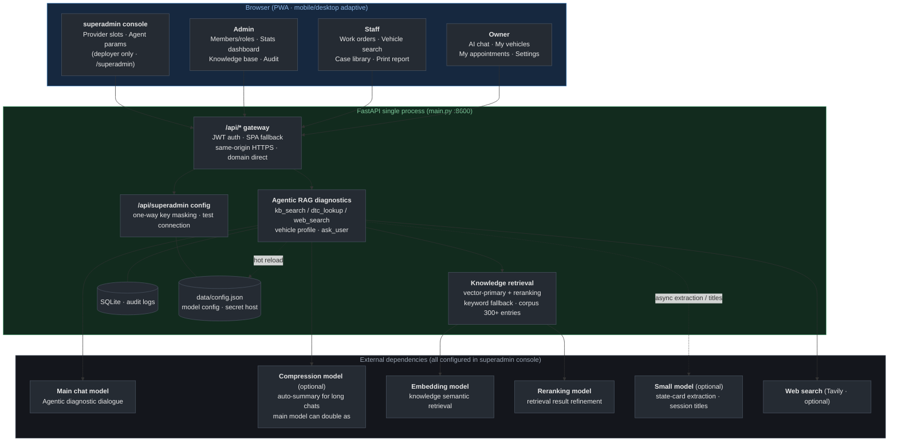
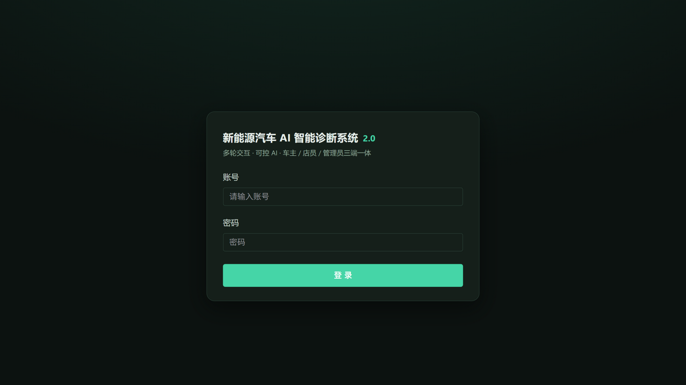
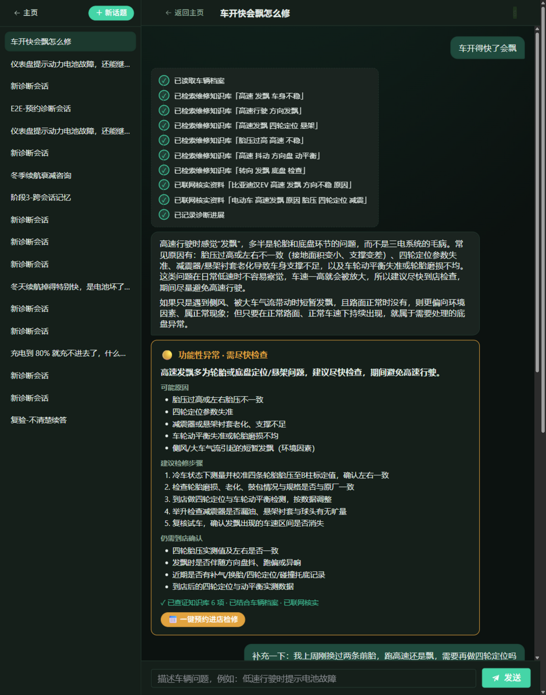
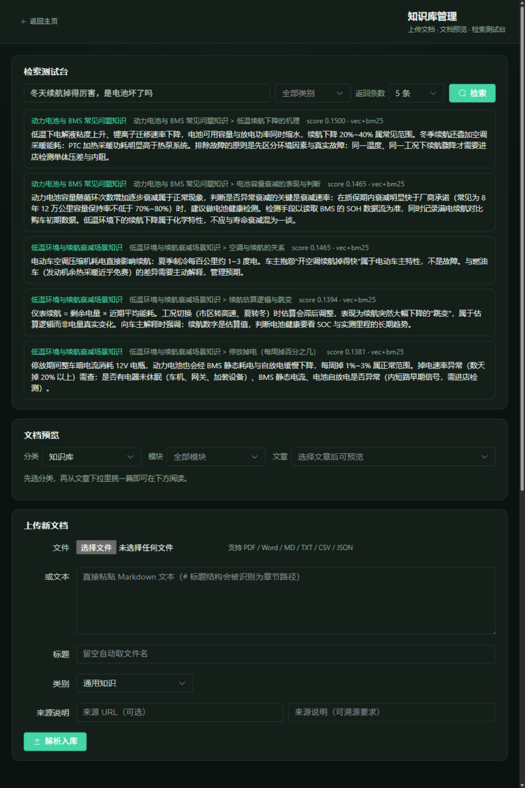
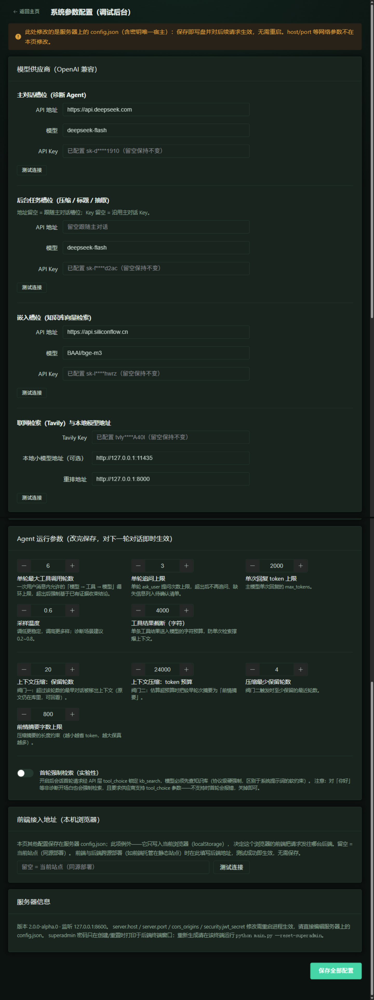

# New Energy Vehicle AI Diagnostic System 2.0

> AI-powered New Energy Vehicle Diagnostic Assistant · A three-role (owner / staff / admin) Agentic RAG diagnostic platform, plus a deployer-only superadmin console

[简体中文](README.md) · **English**

A multi-role intelligent diagnostic platform for new energy vehicle service: owners describe symptoms in multi-turn conversation and get structured diagnostic conclusions with one-click service booking; staff handle the work-order loop — accepting, rescheduling, filling in repair results and contributing cases; admins own members, statistics and audit logs; the deployer additionally gets a **superadmin console** for online operations on model providers and agent parameters. A full-stack rebuild of 1.0 (a pure front-end, single-role tool) — see [CHANGELOG.md](CHANGELOG.md) for version differences.

## Architecture Overview



The system runs on a **five-model division of labor**: main chat model (Agentic diagnostic conversation), context compression model (optional; address/Key default to the main chat config), embedding model (knowledge-base semantic retrieval), reranking model (refines recall results), and a small model (optional; diagnostic state-card extraction and session titles — defaults to the main chat model when unconfigured, so cloud-server deployments need no local compute). All five slots — address / model / Key — are configured online in the superadmin console and take effect immediately on save. Any unavailable component degrades without interruption: compression failure keeps only the most recent turns, embedding failure degrades retrieval to keyword-only, reranking failure keeps the original order, and small-model failure falls back to the main chat model before skipping extraction and title generation entirely. Detailed design and decision rationale: [Architecture Design Document](docs/技术架构设计.md) (Chinese).

## Key Features

- **Agentic diagnostic chat**: DeepSeek function calling drives the agent loop (at most 6 tool rounds and 3 follow-up questions per turn to keep the conversation bounded); the AI's verification process is shown as a live timeline; output is a structured diagnostic card (🟢🟡🔴 severity + likely causes + repair steps + items to confirm).
- **Agentic RAG retrieval**: knowledge is segmented by document structure on import; retrieval is vector-primary on bge-m3 (measurably better than dual-leg fusion) with a cloud reranking pass that re-orders recalled chunks by relevance to the question, degrading to jieba/BM25 keyword retrieval when the vector leg is unavailable or returns nothing — service never stops. Built-in corpus 300+ entries (195 OBD-II DTC definitions + 105 battery/motor/electric-control articles, all source-attributed); retrieval quality is guarded by a red/green gate — 50 canonical fault questions measured at 100% top-3 hit rate (threshold 80%), and injected fault modes (disabling the vector leg / noisy vectors / shuffling) must drop ≥15% to fail loudly. Fixed seed, one-command self-check: `python -m backend.rag.eval_gate`.
- **Controlled follow-up questions**: when information is missing, the AI asks via cards the user answers by picking options or typing freely, with an "I don't know" escape hatch; unanswered questions persist with the session and support offline continuation.
- **Context compression & three-layer memory**: beyond 20 turns or the token budget, older content is auto-summarized (on failure, only recent turns are kept); memory is three-layered — the in-session diagnostic state card, cross-session vehicle profiles (default vehicle carried in automatically), and staff-contributed repair cases (auto-recorded and pulled into the retrieval scope).
- **Booking loop**: one-click booking from the diagnostic card (diagnostic summary attached) → staff accepts / reschedules → fills in repair results → contributes a case → printable HTML report (save as PDF); enforced by a state machine + 30s new-order polling.
- **Privacy boundary**: the diagnostic summary card is always visible to staff; the raw conversation is visible with a work order **only after the owner turns on sharing** (enforced by the backend with 403, not hidden in the frontend).
- **Multi-tenant isolation**: all business queries filter by `tenant_id` (retrieval index sharding is a pre-commercialization to-do).
- **Statistics & audit**: model usage aggregated for today/7d/30d, appointment status distribution, case and account counts; logins, account creation, role changes, appointment transitions, privacy changes and more all land in the audit log, filterable by action.
- **Mobile & PWA**: adaptive layout + home-screen icon standalone window; iOS 16px input anti-zoom, safe-area and dynamic viewport handling.

## Demo

The login page routes each role to its own home: owner / staff / admin / superadmin:



Owner-side Agentic diagnostic chat: the AI calls vehicle-profile and knowledge-base tools on its own (timeline shown live), asks controlled follow-up questions via cards when information is missing, and finally produces a structured diagnostic card (severity + likely causes + repair steps + items to confirm) with one-click booking:



Admin knowledge-base retrieval bench: hits are annotated with source (vector / keyword) and score:



superadmin console (deployer only): edit model provider slots and agent parameters online, effective on save (Keys shown one-way masked):



## Online Demo

Alibaba Cloud ECS + Cloudflare tunnel, same-origin direct (FastAPI :8600):

https://nev.evoidngc.top

Demo accounts (initial password = username): user001 (owner) · staff001 (staff) · admin (admin)

Full walkthrough for all four roles (owner / staff / admin / superadmin): [User Guide](docs/操作指南.md) (Chinese).

## Quick Start

Requirements: Python 3.10+ (developed on 3.12), Node.js 18+. Registering with SiliconFlow for the free embedding / reranking models is recommended (see the config template below); a local llama.cpp llama-server or leaving everything empty also works — with nothing configured, semantic retrieval degrades to keyword retrieval and async extraction falls back to the main chat model.

```bash
# 1) Backend dependencies
python -m pip install -r requirements.txt

# 2) Config: create data/config.json (contains secrets, not committed; template below)

# 3) Build the frontend
cd frontend && npm install && npm run build && cd ..

# 4) Start: creates tables, demo accounts and demo vehicles automatically
python main.py                # http://127.0.0.1:8600
python main.py --host 0.0.0.0 # on-prem LAN direct access

# 5) Import the built-in knowledge base (300+ entries, deduplicated by title, idempotent)
python -m backend.seed.load_corpus
```

Development mode: backend `python main.py --reload`, frontend `cd frontend && npm run dev` (vite proxies /api → 8600).

### data/config.json Template

```json
{
  "server": { "host": "127.0.0.1", "port": 8600 },
  "deepseek": {
    "base_url": "https://api.deepseek.com",
    "main_model": "<main chat model name>",
    "main_key": "<your DeepSeek API key>",
    "background_model": "<background compression model name>",
    "background_key": "<background model key, may reuse main_key>"
  },
  "tavily": { "api_key": "<your Tavily API key>" },
  "local_models": {
    "embedding_url": "https://api.siliconflow.cn",
    "embedding_model": "BAAI/bge-m3",
    "embedding_key": "<your SiliconFlow API key>",
    "rerank_url": "https://api.siliconflow.cn",
    "rerank_model": "BAAI/bge-reranker-v2-m3",
    "rerank_score_threshold": 0.0
  },
  "small_model": {
    "base_url": "",
    "model": "",
    "disable_thinking": true
  }
}
```

- All API keys live only in this file: **not committed, never sent to the frontend, never logged**; `data/` is in `.gitignore`.
- **SiliconFlow is the recommended provider (free models — the retrieval pipeline costs nothing)**: embedding and reranking point to SiliconFlow by default — `BAAI/bge-m3` for embeddings (1024-dim, ~150-190ms P50 per query) and `BAAI/bge-reranker-v2-m3` for reranking (~140ms P50 for top-5 chunks) are both within the free tier; a single key lights up the full semantic retrieval + reranking pipeline. On-prem deployments can point these to a local llama.cpp llama-server instead (e.g. `http://127.0.0.1:11436`).
- `local_models` (optional) points to OpenAI-compatible HTTP services; empty means the capability degrades: `embedding_url` is the embedding service (serving `/v1/embeddings`); a non-empty `embedding_key` sends Bearer auth (the URL must not contain `/v1`; a misconfigured suffix is stripped automatically); `rerank_url` is the reranker service (serving `/v1/rerank`), which refines the top_k vector-recall results — `rerank_enabled` turns it off entirely, `rerank_key` defaults to `embedding_key`, and `rerank_score_threshold` is the rerank score threshold (0 = pure relevance ordering; >0 promotes high-score chunks and keeps the rest in original order — measured score separability on the current corpus is weak, hence the default 0). If the reranker is unreachable the original order is kept and retrieval never breaks; `subagent_url` is an optional local lightweight chat endpoint (e.g. llama-server :11435) for on-prem deployments only.
- `small_model` is the async small-model slot for session titles / state-card extraction (OpenAI-compatible): leaving both `base_url` and `model` empty falls back to the background main-chat model (with `thinking: disabled` attached automatically — measured ~560ms P50 per title on DeepSeek); other OpenAI-compatible APIs also work (e.g. SiliconFlow `Qwen/Qwen3.5-4B` is free, but the free tier's queueing tail can reach 1 minute in production measurements — leaving it empty is the recommended production setup). Temperature, token limits and input truncation are all tunable online in the superadmin panel.
- When the Tavily key is missing or invalid, the `web_search` tool disables itself; everything else keeps working.
- `cors_origins` is optional; the default whitelist lives in `backend/config.py` (production domain + local dev/direct ports). Same-origin deployment (the domain *is* the system) never triggers CORS and needs no configuration; only cross-origin frontend/backend debugging needs it.
- The background compression slot can be trimmed: omitting `background_base_url` / `background_key` reuses the main chat address and key; `background_model` defaults to `deepseek-flash` — set it to the main model's name to let the main model double as compressor.

### Demo Accounts & First Deployment

First start creates the same three demo accounts as listed under "Online Demo", for demonstration convenience only:

> ⚠️ On a real deployment, have every account change the initial password immediately via "Settings → Change password". The change-password endpoint enforces strength rules (≥8 chars, letters + digits, must not contain the username) and refuses to set the password back to the weak "password = username" form.

### superadmin Console

An operations channel for public deployments: first start creates the `superadmin` account (role `superadmin`) with a 20-char random alphanumeric password **printed to the backend process's terminal on every start** (open the minimized cmd window the launcher spawns). The plaintext lives only in the server-local `data/config.json` under the `superadmin` section — same secret host as the API keys; not in the repo, not in the database, not in any API response; invisible and immutable from the admin member management. After login you get the `/superadmin` config page (AstrBot-style WebUI) with online editing for:

- Model providers: API address, model and key of all five slots (main / background / embedding / reranking / small model; keys one-way masked, blank = unchanged), the rerank toggle and score threshold, small-model temperature and other params, plus the Tavily key — each slot with a "test connection" button.
- Frontend API address (this browser only): blank = same-origin (the standard "the domain is the system" shape; the login page no longer offers this setting). Fill it in only when one browser needs to point at another backend (temporary debugging) — stored in that browser's localStorage only, never in server config, with "test connection".
- Agent runtime parameters: max tool rounds per turn, follow-up question limit, reply token cap, sampling temperature, tool-result truncation, compression dual valves (rounds kept / token budget / minimum kept rounds / summary length), first-round forced retrieval (hard `tool_choice` lock at the API layer).

Everything except `server`/`security` takes effect hot, no restart. Forgotten password: run `python main.py --reset-superadmin` on the server terminal (the old password is invalidated immediately, the new plaintext is written back to config.json and printed on every start as usual).

### Production Reset

Demo-period business data (test accounts, appointments, cases…) lives in `data/data.db`; rebuild before going live:

```bash
rm data/data.db                     # Windows: del data\data.db
python main.py                      # recreate tables + demo accounts + demo vehicles
python -m backend.seed.load_corpus  # re-import the built-in corpus (auto-deduplicated)
```

## Deployment Topology

| Shape | How | Use case |
|---|---|---|
| Standalone / on-prem LAN | `python main.py --host 0.0.0.0`, open TCP 8600 on the firewall | daily in-shop use |
| **Cloud server + domain (current)** | copy the project to a cloud server → `python main.py` → point the domain at the server (HTTPS → 8600); frontend and backend same-origin, **the domain is the system**, zero cross-origin configuration | public demo / production |

The backend is a pure orchestration layer and hosts no model compute: the five model slots (main chat / compression / embedding / reranking / small model) all point to OpenAI-compatible APIs (embedding and reranking both have free models — the retrieval pipeline costs nothing), so the compute lives entirely in the cloud. The backend process uses well under 100 MB of memory and runs on the cheapest cloud server or even a home PC; self-hosting via a local llama.cpp llama-server is an optional form only. All slot addresses are configurable online in the superadmin console — switching providers requires no code changes.

## Security Design

- **Secrets**: managed entirely in backend config (1.0 kept plaintext keys in frontend localStorage — removed); the frontend build output contains zero secrets (verified by pattern scanning before every release).
- **Auth**: PBKDF2-SHA256 (240k iterations) password hashing + JWT (7 days); owner / staff / admin / superadmin role checks at every endpoint (superadmin is deployer-only, its API group is separate and fully hidden from admin).
- **Login rate limiting**: per-account failure counting; 5 failures within a 15-minute window locks the account temporarily — during the lock, password verification is skipped and requests are rejected outright; a successful login resets the counter; lock events are audited (`login_locked`). In-process in-memory implementation; multi-instance deployments need centralized storage.
- **Weak-password protection**: password changes enforce strength rules (≥8 chars, letters + digits, must not contain the username); the initial password = username exists for demo convenience only, and the change-password path refuses to revert to it.
- **Authorization**: cross-account sessions / orders are answered as "not found" (404) and never leak existence; the owner's privacy switch is enforced by the backend.
- **Audit**: login success / failure / lock, account creation, deactivation, password reset, appointment transitions, privacy changes, password changes — all written to the `audit_logs` table.

## Testing

```bash
python -m pytest tests/    # 97 cases, fully offline on a temp DB, never touches real data/
cd frontend && npm run typecheck && npm run build
```

Covers: chunking & retrieval, context compression, agent history / tool-call record consistency (including interrupted-run scenarios), the API permission matrix, appointment state transitions, case ingestion, member management, login rate limiting, password strength, state-card extraction and session-title generation (all external model calls mocked, fully offline).

## Project Layout

```
main.py                  entry point (--host / --port)
backend/
  config.py              config loading (data/config.json)
  security.py            PBKDF2 hashing + JWT
  db/                    SQLAlchemy models + lightweight migration
  api/                   auth (rate limiting/password) · kb · chat (SSE streaming) · cases
                         · appointments (booking loop) · vehicles · admin_users
                         · stats (stats+audit) · system
  rag/                   embedder / vecstore / bm25 / ingest / retrieve / eval_gate
  core/
    providers/           llm (main chat / background summary) · tavily
    tools/registry.py    tool registry
    agent/runner.py      agent loop + tool execution + structured diagnostic output
    agent/compressor.py  context compression (auto-summary for long chats)
    agent/extractor.py   lightweight local model: state-card extraction + session titles
  seed/                  demo accounts + demo vehicles + built-in corpus (corpus/)
  app.py                 app factory (CORS + static hosting + SPA fallback)
frontend/                Vue 3 + TypeScript + Vite + Element Plus
tests/                   pytest regression suite (97 cases)
data/                    runtime-generated: config.json / data.db / logs/ (not committed)
```

## Known Limitations

- The public deployment currently runs on "domain + non-standard port (8600)" as a stopgap: the trial instance used does not qualify for ICP filing; it moves to standard 443 once the filing clears.
- The retrieval index is not sharded by tenant (all tenants currently share the built-in corpus); must be addressed before multi-tenant commercialization.
- Login rate limiting is in-process in-memory state; multi-instance deployments need centralized storage.
- The reranking gain on the current corpus is modest (top-3 already saturated at 100%, top-1 +4pp); benefits on larger corpora need re-evaluation. It can be switched off with one toggle.
