# 新能源汽车 AI 智能诊断系统 2.0 · 操作指南

> 适用版本 2.0.0 · 面向系统的四类使用者：**车主、店员、管理员与部署者**
> 部署与配置见 [README](../README.md)，架构与设计决策见 [技术架构设计](技术架构设计.md)，版本差异见 [CHANGELOG](../CHANGELOG.md)。

---

## 1. 软件概述

### 1.1 系统简介

新能源汽车AI智能诊断系统（V2.0.0）是面向新能源汽车维修服务场景的多角色智能诊断平台。系统以大语言模型驱动的智能诊断对话为核心，融合知识库检索（RAG）、联网核实与车辆档案，为车主提供结构化的故障诊断结论；同时为门店提供从线上诊断到线下服务的完整业务闭环：车主在获得诊断结论后可一键预约到店，店员在工单闭环中接单、改约、回填维修结果并沉淀维修案例，管理员掌握成员、统计与审计，部署者另可通过专属调试后台在线配置模型服务与运行参数。

系统采用前后端一体架构：后端基于 Python FastAPI 框架，单进程同时提供 API 服务与前端页面托管；前端基于 Vue 3、TypeScript 与 Element Plus 构建，支持桌面与手机自适应访问，并支持添加到主屏幕以独立窗口运行。诊断引擎为服务端 Agentic RAG 架构：模型通过工具调用自主检索内置维修知识库（300 余条知识条目）、查询故障码、读取车辆档案并向用户追问，检索以向量语义检索为主路、关键词检索自动降级保底。

### 1.2 主要功能

系统包含四个使用端，主要功能如下：

1. **车主端**：AI 智能诊断对话（多轮交互、证据时间线、受控追问、结构化诊断卡）、车辆档案管理、预约管理与隐私设置；
2. **店员端**：预约工单处理（接单、改约、回填维修结果）、车辆档案检索、案例库沉淀、诊断报告打印；
3. **管理端**：成员与角色管理、经营统计看板、知识库管理（文档上传、检索测试）、审计日志查询；
4. **部署者调试后台**：模型服务四槽位在线配置（保存即生效）、智能体运行参数调整、密钥安全管理。

### 1.3 运行环境

- **服务器端**：CPU 2 核及以上，内存 4GB 及以上；操作系统为 Linux 或 Windows；软件环境为 Python 3.10 及以上版本及其中文分词、向量检索等依赖库。
- **客户端**：主流现代浏览器（Chrome、Edge、Safari、Firefox 及同等内核浏览器），支持桌面电脑、平板与手机访问，无需安装插件。
- **外部模型服务**：系统需接入 OpenAI 接口兼容的大语言模型服务（用于诊断对话）、向量化模型服务（用于知识库语义检索，未配置时自动降级为关键词检索）；可选接入联网检索服务与轻量本地模型。以上服务地址均可在部署者调试后台在线配置。

## 2. 安装与启动

### 2.1 安装步骤

1. 安装 Python 3.10 及以上版本与 Node.js 18 及以上版本。
2. 克隆本仓库，在根目录执行 `python -m pip install -r requirements.txt` 安装后端依赖。
3. 创建配置文件 `data/config.json`，填入大语言模型服务地址、模型名称与 API 密钥等配置项（模板见 README「快速开始」）。
4. 在 `frontend/` 目录执行 `npm install` 与 `npm run build` 完成页面构建。
5. 在程序根目录执行 `python main.py` 启动服务，系统自动完成数据表创建与演示账号初始化。
6. 执行 `python -m backend.seed.load_corpus` 导入内置维修知识库（300 余条，自动按标题去重）。

完整依赖说明、`data/config.json` 模板与生产部署形态见 [README](../README.md)「快速开始」「部署形态」。

### 2.2 访问系统

- **本机访问**：浏览器打开 `http://localhost:8600`。
- **店内局域网访问**：以 `python main.py --host 0.0.0.0` 启动后，店内电脑或手机浏览器访问 `http://服务器IP:8600`。
- **云服务器部署**：将域名解析指向服务器并配置 HTTPS 后，访问域名即进入系统；在线体验环境见 README「在线体验」。

首次启动自动创建演示账号（初始密码与账号名相同）：`user001`（车主）、`staff001`（店员）、`admin`（管理员）。正式使用前请各账号在「设置」页立即修改密码。

## 3. 登录系统

打开系统地址即进入登录页。在登录页输入账号与密码，点击「登 录」按钮；系统按账号角色自动分流进入对应端首页：车主进入车主端，店员进入店员端，管理员进入管理端。登录页如图 3-1 所示。

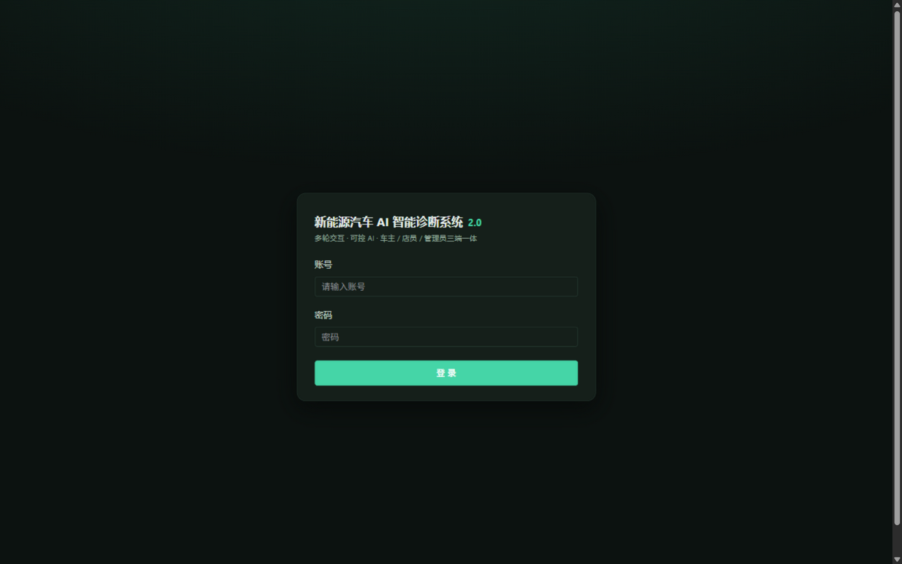

*图 3-1　登录页*

连续多次密码错误时，账号将被临时锁定一段时间以防暴力破解；锁定期间即使输入正确密码也无法登录，稍后自动解除。忘记密码时请联系管理员在成员管理中重置。

## 4. 车主端使用说明

### 4.1 车主端工作台

车主登录后进入车主端工作台，页面提供四个功能入口：AI 助手对话、我的车辆、我的预约与设置，点击卡片上的「进入」按钮即可打开对应功能。车主端工作台如图 4-1 所示。

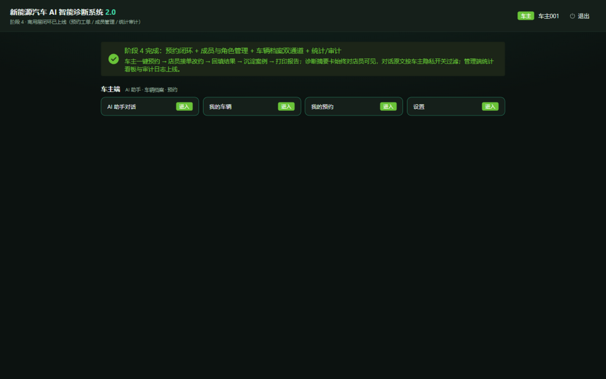

*图 4-1　车主端工作台*

### 4.2 AI 智能诊断对话

在 AI 助手对话页，左侧为会话列表（可新建多个话题），中部为对话区。首次进入时页面提供常用问题快捷入口，也可在底部输入框直接描述车辆问题后点击「发送」。对话页布局如图 4-2 所示。

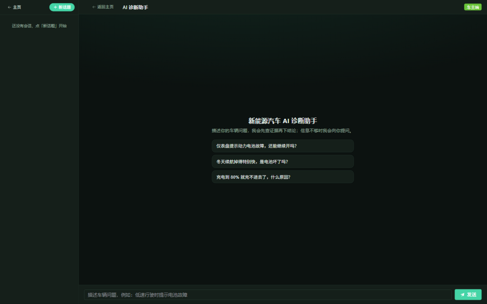

*图 4-2　AI 诊断对话页*

发送问题后，AI 自动读取您的车辆档案，并检索维修知识库与故障码表进行查证，查证过程以时间线形式实时展示（如「已读取车辆档案」「已检索维修知识库」），保证诊断结论有据可查。

当 AI 判断已有信息不足以给出可靠结论时，会以追问卡片列出补充问题：每个问题提供若干常见选项供点选，也支持手动输入；若无法确认，可选择「不知道 / 不清楚」，AI 将基于已有信息继续判断，不会卡住流程。受控追问卡片如图 4-3 所示。

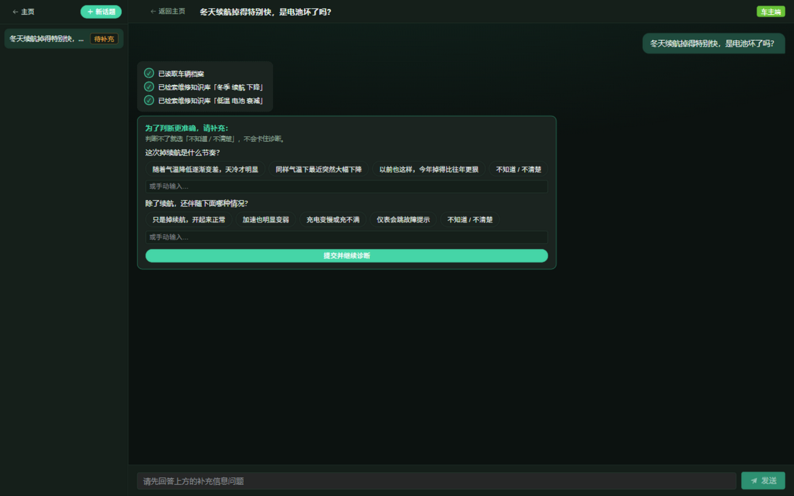

*图 4-3　受控追问卡片*

补充信息提交后，AI 继续分析并输出结构化诊断卡，内容包括：严重度标识（绿色正常、黄色注意、红色需检修）、结论概述、可能原因、建议检修步骤与仍需现场确认的事项。诊断卡示例如图 4-4 所示。

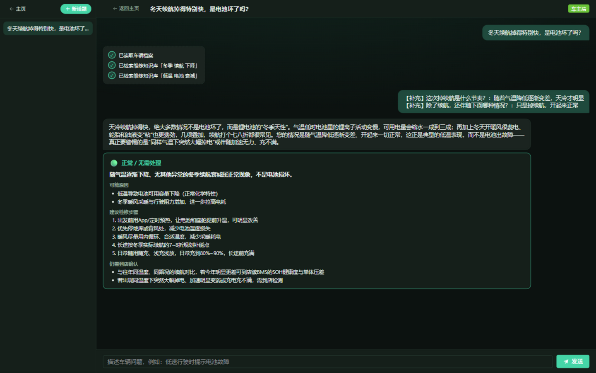

*图 4-4　结构化诊断卡*

当诊断结论需要到店检修时，诊断卡下方提供一键预约入口，点击后系统自动携带本次诊断摘要创建预约工单，无需重复描述车况。

### 4.3 我的车辆

在我的车辆页可查看已登记的车辆信息（品牌车型、车牌、VIN 码、用途等）与历史诊断记录；点击右上角「管理车辆」可添加、编辑车辆信息。登记的车辆档案会在 AI 诊断时自动作为背景信息使用，默认车辆无需在对话中重复介绍。我的车辆页如图 4-5 所示。

*图 4-5　我的车辆页*

### 4.4 我的预约

在我的预约页可查看全部预约记录及其当前状态（待接单、已接单、已完成、已取消），点击右上角「新建预约」可不经诊断直接创建预约。预约创建后由门店店员接单跟进，维修完成后可在店内打印诊断维修报告。我的预约页如图 4-6 所示。

*图 4-6　我的预约页*

### 4.5 隐私设置与修改密码

在设置页可进行隐私设置与密码管理。「店员可见我的对话记录」开关默认开启：开启后，接待您的服务人员可查看本次诊断的完整对话过程，便于提前准备配件；关闭后，店员仅能看到 AI 生成的诊断摘要卡（不含对话原文），后端对权限做强制校验。该开关可随时更改，对之后的诊断立即生效。设置页如图 4-7 所示。

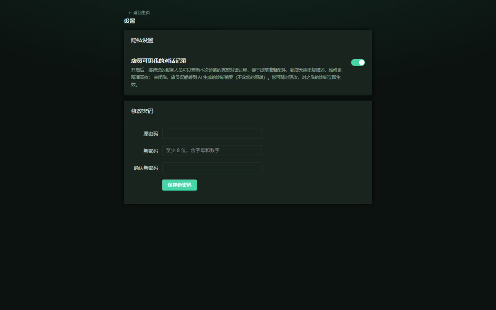

*图 4-7　设置页*

在「修改密码」区域输入原密码与新密码（至少 8 位，须同时包含字母和数字）后点击「保存新密码」完成修改。建议首次登录后立即修改初始密码。

## 5. 店员端使用说明

### 5.1 店员端工作台

店员登录后进入店员端工作台，提供预约工单、诊断台、车辆档案检索、案例库与设置五个功能入口。店员端工作台如图 5-1 所示。

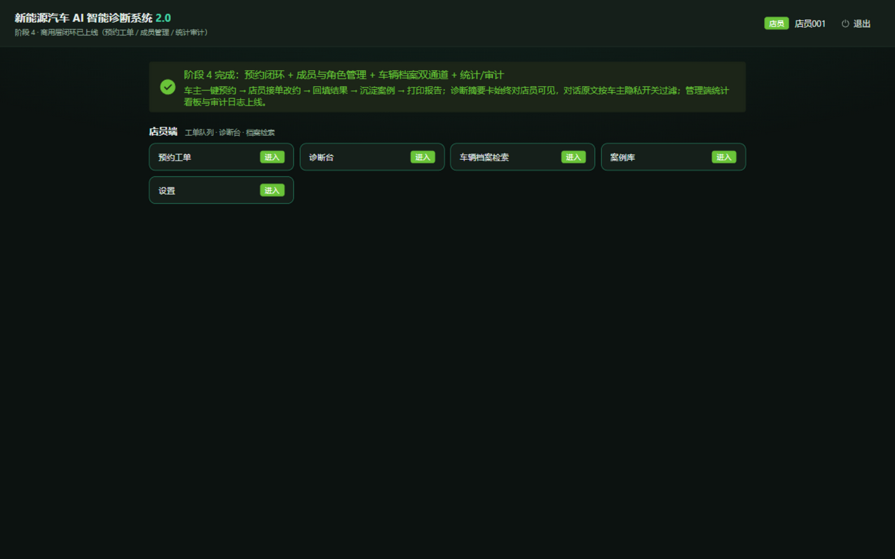

*图 5-1　店员端工作台*

### 5.2 预约工单处理

在预约工单页可按状态筛选查看工单（全部、待接单、已接单、已完成、已取消）。工单卡片中展示车主诊断摘要（始终可见）与预约信息：对「待接单」工单可执行接单或改约；接单后按约定时间完成维修服务，并回填维修结果；回填完成后工单进入「已完成」状态，可一键将本次维修沉淀为案例。有新工单进入待接单队列时系统会自动提醒。预约工单页如图 5-2 所示。

*图 5-2　预约工单页*

### 5.3 车辆档案检索

在车辆档案检索页输入车牌、VIN 码或品牌车型关键字后点击「检索」，即可查看匹配的车辆档案与历史诊断摘要，便于到店接待时快速掌握车况。检索结果页如图 5-3 所示。

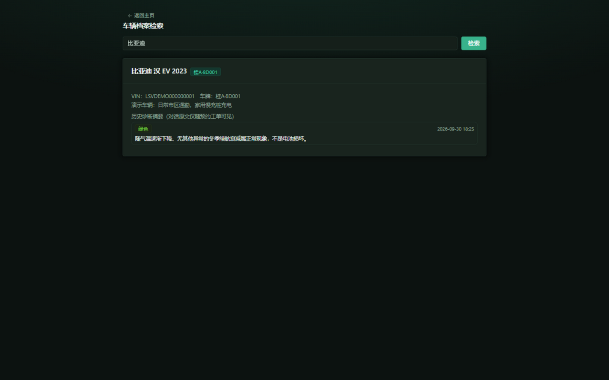

*图 5-3　车辆档案检索页*

### 5.4 案例库

案例库集中沉淀已完成的维修案例。在预约工单完成后点击「沉淀案例」，系统自动将该次诊断与维修信息整理入库；沉淀的案例会纳入后续 AI 诊断的检索范围，使诊断结论能够参考本店真实维修经验。案例库页如图 5-4 所示。

*图 5-4　案例库页*

### 5.5 诊断报告打印

在已完成的工单详情中可打开 HTML 版诊断维修报告，报告包含车辆信息、诊断结论、维修结果等内容，通过浏览器打印功能可直接另存为 PDF 或纸质打印交付车主。

## 6. 管理端使用说明

### 6.1 统计看板

统计看板展示门店经营关键指标：模型用量（今日 / 近 7 天 / 近 30 天的调用次数与 Token 用量）、预约工单状态分布、沉淀案例数与在职账号数。统计看板如图 6-1 所示。

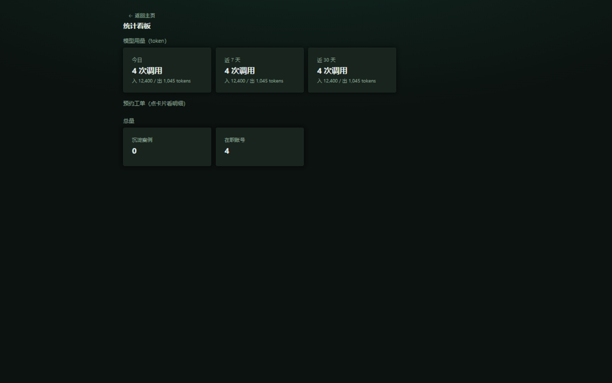

*图 6-1　统计看板*

### 6.2 成员与角色管理

在成员与角色管理页可查看全部账号（账号、姓名、角色、车辆、状态、最近登录），点击右上角「新建账号」创建成员，并通过每行的角色下拉框调整角色（车主 / 店员 / 管理员），支持停用账号、修改密码与重置密码操作。成员与角色管理页如图 6-2 所示。

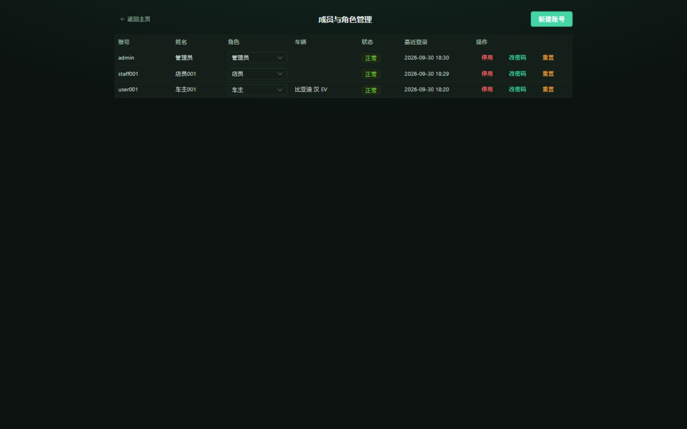

*图 6-2　成员与角色管理页*

### 6.3 知识库管理

知识库管理页提供检索测试台、文档预览与文档上传三项能力：检索测试台输入查询语句后可实测知识库召回效果，命中结果标注来源路径、得分与检索通道（向量 / 关键词）；文档预览支持按分类、模块浏览已入库知识；上传新文档支持 PDF、Word、Markdown、TXT、CSV、JSON 格式，系统按文档标题结构自动分段入库，可填写来源说明以满足可溯源要求。知识库管理页如图 6-3 所示。

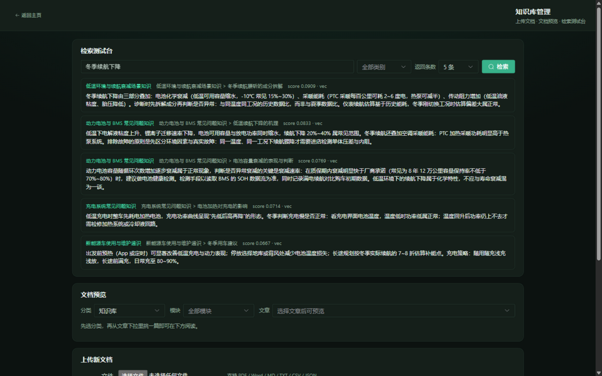

*图 6-3　知识库管理页（检索测试台）*

### 6.4 审计日志

审计日志完整记录登录成功、登录失败、账号锁定、新建账号、角色变更、密码修改、预约流转、隐私变更等关键操作，每条记录包含时间、操作人、动作、详情与来源 IP，支持按动作类型筛选，满足门店安全管理与溯源需求。审计日志页如图 6-4 所示。

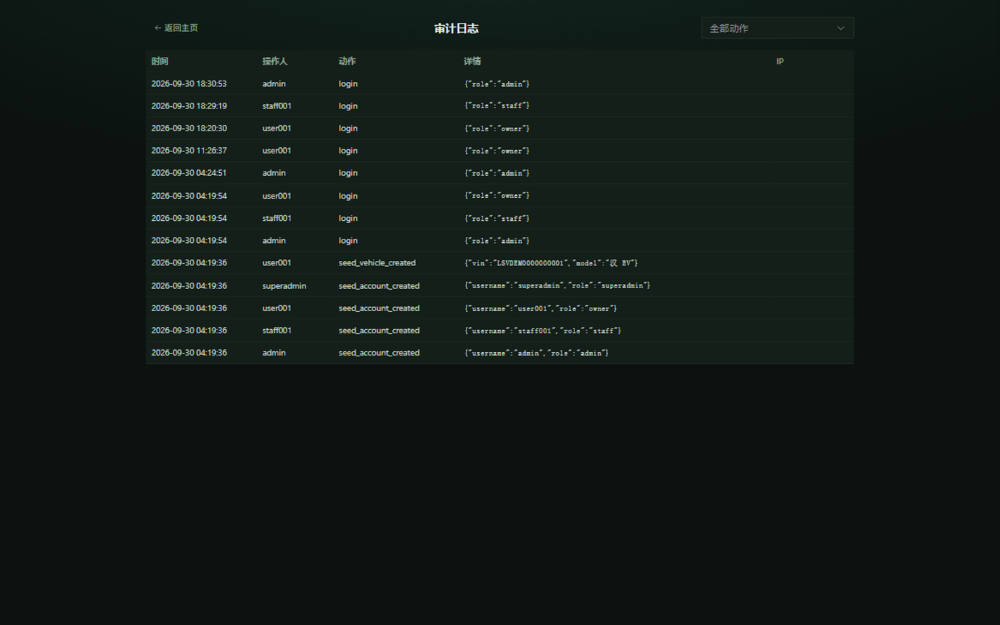

*图 6-4　审计日志页*

## 7. 部署者调试后台

部署者调试后台（superadmin）面向系统部署与运维人员，与管理端相互隔离，仅部署者可访问，入口为 `/superadmin`。首次启动后端时系统自动创建 superadmin 账号并生成 20 位随机密码，打印在后端进程启动终端上；遗忘密码时在服务器执行 `python main.py --reset-superadmin` 重新生成（旧密码立即作废，明文同步写回 `data/config.json`，之后每次启动照常打印）。

后台提供两类在线配置能力：

1. **模型服务配置**：主对话模型、上下文压缩模型、向量化模型三个槽位的接口地址、模型名称与密钥（密钥单向掩码显示，留空即不修改），以及联网检索服务与本地小模型地址，每个槽位均提供「测试连接」实测功能；
2. **智能体运行参数**：单轮最大工具调用轮数、追问上限、回复长度上限、采样温度、上下文压缩策略等。

所有配置保存后立即生效，无需重启服务。

## 8. 常见问题

1. **登录时提示账号被锁定**：15 分钟窗口内连续 5 次密码错误会触发临时锁定，锁定期间直接拒绝登录尝试，请稍后再试或联系管理员。
2. **AI 迟迟未回复或提示服务不可用**：请检查服务器到大语言模型服务的网络连接与密钥配置；单次诊断的查证过程通常在数秒到数十秒内完成。
3. **诊断结论与实际车况不符**：AI 结论基于描述与知识库推断，诊断卡中的「仍需现场确认」事项请务必由维修技师实车检查确认。
4. **知识库检索结果不理想**：管理员可在知识库检索测试台实测召回；如召回不足，可补充上传相关维修文档，系统按文档结构自动分段入库。
5. **手机访问**：直接使用浏览器访问系统地址即可，页面自动适配手机屏幕；也可通过浏览器「添加到主屏幕」功能将系统添加为独立应用图标。
